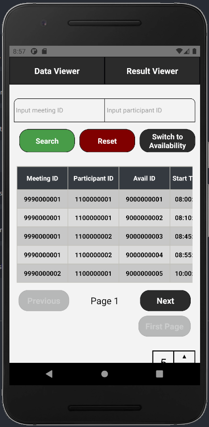
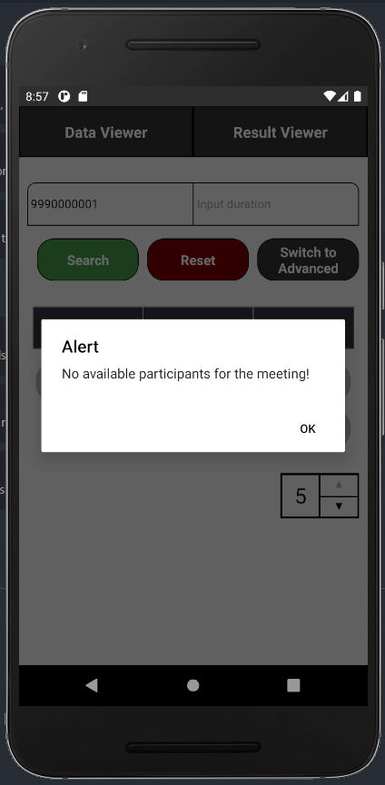
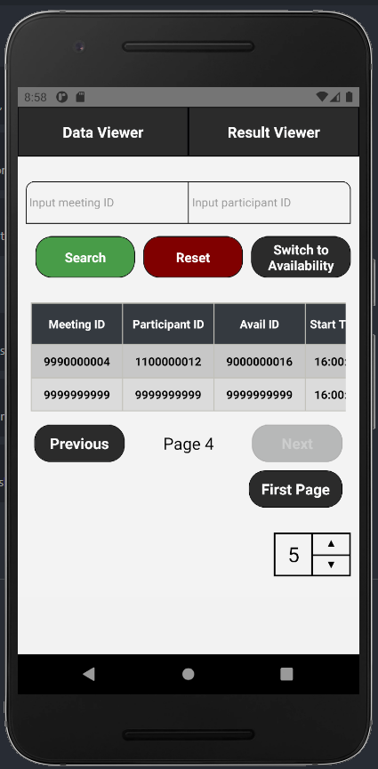
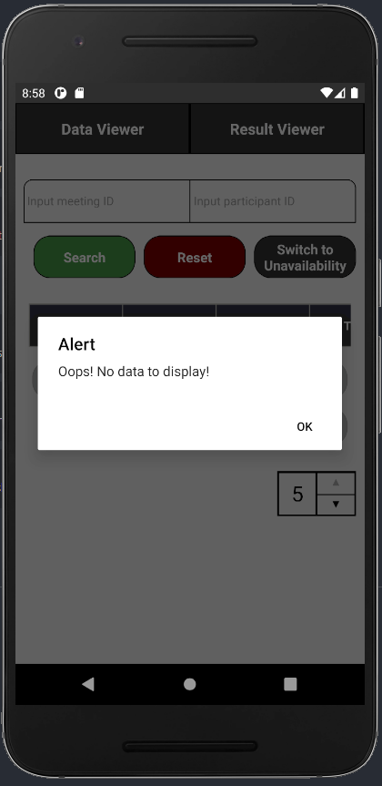
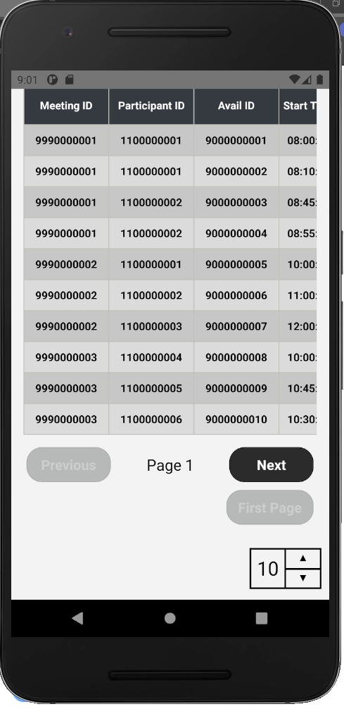
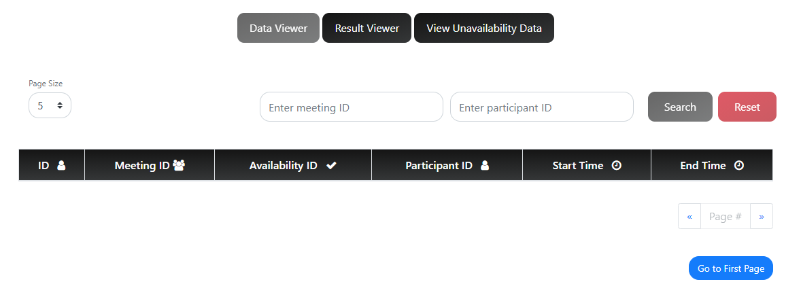
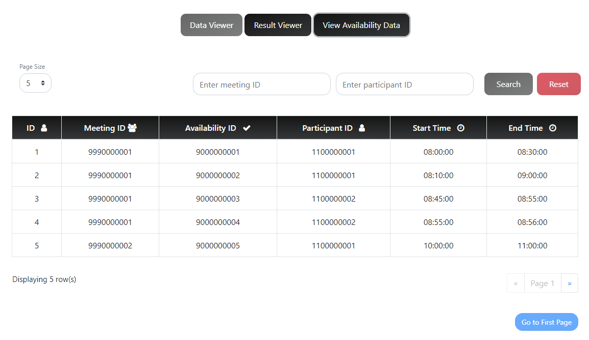
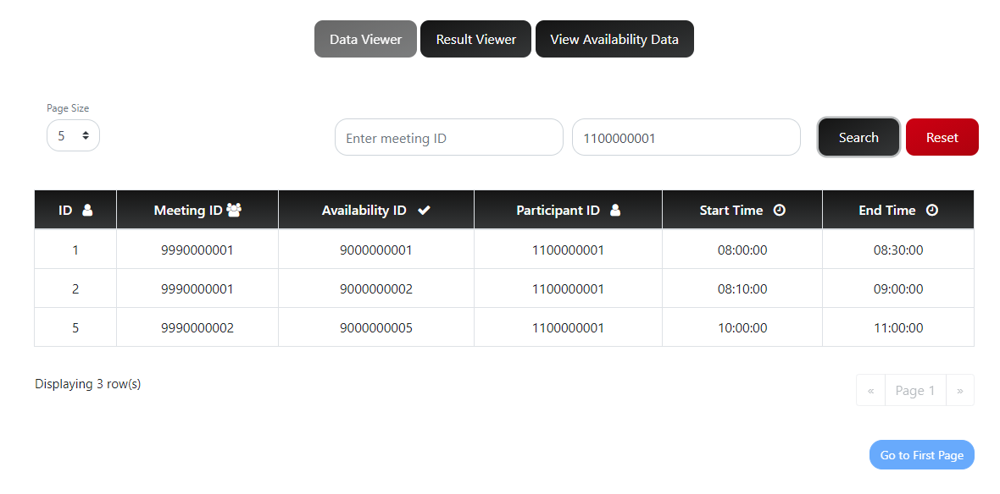
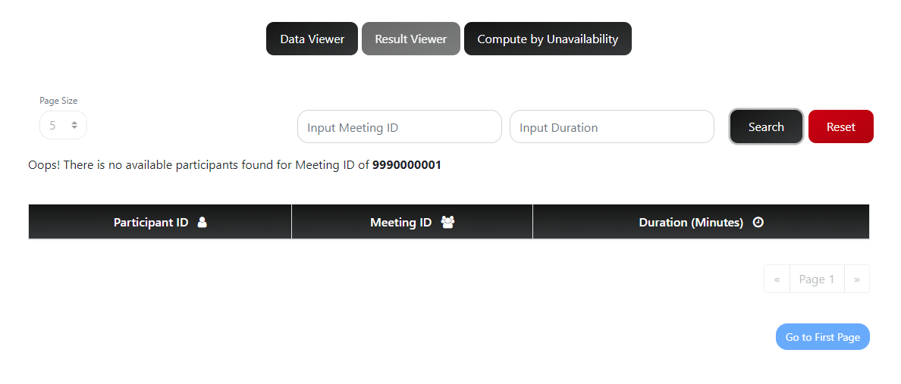
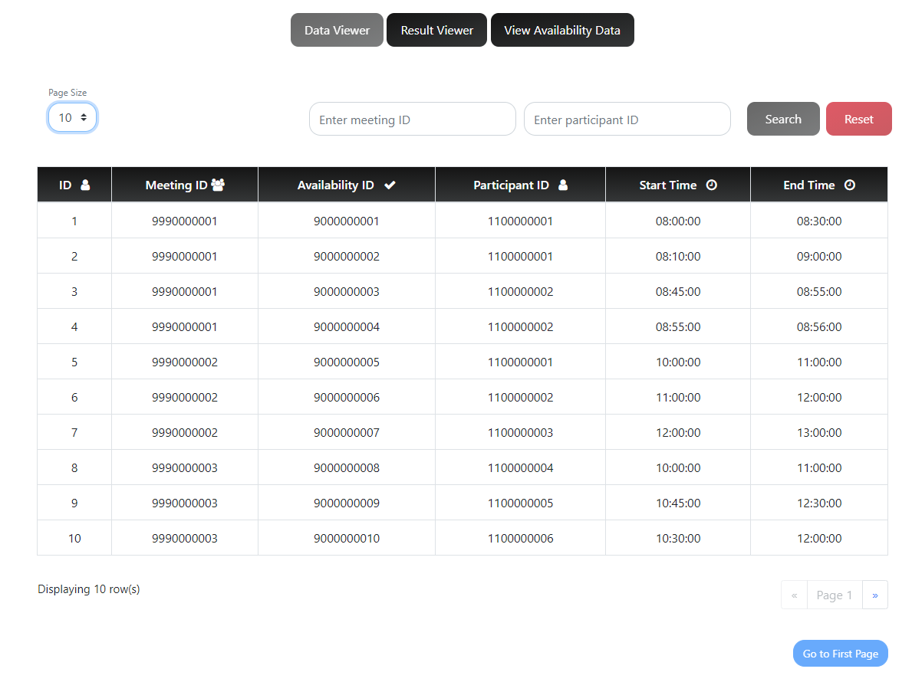

# JiBaBoom
A pair programming project that relies on Sort & Search Algorithms to provide meeting timings, identify time conflicts, in the most efficient manner

##
```
1. Github hosted frontend URL - https://ades-fsp.github.io/jibaboom-theateam/
2. Heroku hosted backend URL - https://theateam-ades.herokuapp.com/
3. APK Download URL - https://github.com/AlwinSingh/MeetingPlanner/releases/tag/V1

------- Mobile App Screenshot --------
```


\
\
\
\



```------- Web Screenshot --------```
\
\
\
\

