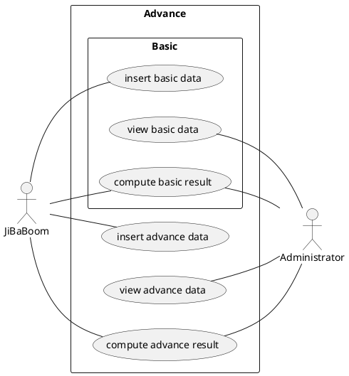
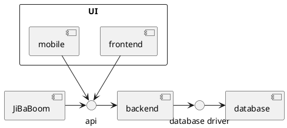
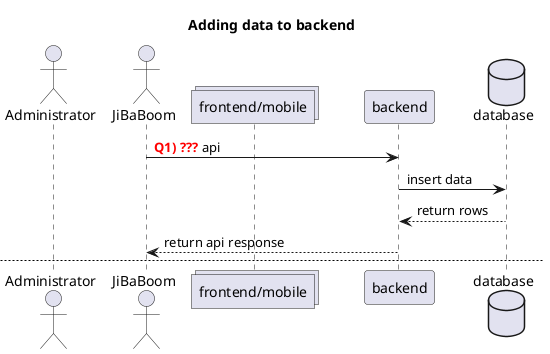

> For this worksheet, you'll need plantuml to view the diagram

# Project Worksheet

This document aims to provide you with a better understanding of the structure/flow of the project.

## Use Case

Recall that there are a few functionality requried from this system


Link: [Use Case Diagram](https://www.plantuml.com/plantuml/svg/0/RP5D4e8m38NtFKMMik0EY3jl4Kh4ED0wRS25mzrjeVoEsULxBydhjF22JlgkLIqz1CI2u-OfKBCZBMoDGYtMmPrBBAtj03sygYhHQzsnOIyEOnSaZ435KJHDIy4meD44NmMXDbwYPvrehB0IyXmkR3mvWMgIQnJCLijbOFhibJWmtrijsdRlNYYv7Fc-bIpcIiBvtXaly-lcIHdLduYONhQ5d0CU-37Y6c_nx086TDk5ISTET6ktnQCgoDJX0ty0 "project_worksheet")

### Question

The above listed are functional requirements, that is, **WHAT** the system should allow users to do. There are also non-functional requirements that state **HOW** a system should perform.

-   Q1. Consider the use case of `Compute basic/advance result`, **HOW** is this functionality made available to both JiBaBoom and Adminstrator _(Hint: They are different)_? `As what we can understand, JiBaBoom is not a physical user whereas the Administrator is. It would be difficult (not impossible) for the system (JiBaBoom) to use the frontend to navigate to compute the basic / advance result whereas the Administrator (physical user) is able to do so. The functionality of the basic/advance result is made available to JiBaBoom through the Application Program Interface (APIs) to communicates to the Server (Back-end System). Through the API it will return the appropraite result in JSON format. Whereas there is a UI Logic / Layer for the Administrator, he or she will have to use the Frontend User Interface to compute basic / advance result. The frontend will allow the administrator to input data, filter data and paginate through the Data. The backend will subsequently retrieve (get) / post (insert) data from / into the database. Frontend also allows for data to be displayed in a much more readable format for the Administrator.`

-   Q2. Consider the use case of `Insert basic/advance data`. **HOW** is the data stored? `For the insert basic / advance data both will have to require a POST method to send data to the APIs respectively. Be it through a request body or through a query (In the URL). The data is taken in by the APIs which then call a function that will also take in the values passed to the API, then consumed by the backend to get inserted into the Database. In summary, the data is taken in by using POST to send the data to the system so that the backend can process it & insert the data accordingly to the database. The data that is usually inserted should be in JSON format.`

---

## Components

Recall that there are 3 or 4 components required

-   Frontend
-   Backend
-   Database
-   Mobile (For ADES students)

And in addition, **JiBaBoom**, the company you're developing for will also use your system.

Below is how they are connected with each other, and the means which they are connected.


Link: [Component Diagram](https://www.plantuml.com/plantuml/svg/0/JK-x3i8m3Dpz5LRt_WAgki7EL6LmOhT4j0boGXV4lnCUJR5aoRxJdSzTogJvlioWuZA5QHOy7_41M6eODOOiWSrtNQBrinXu0e0lX8xa11kcJ9QI8AjVHHkaXCmmd7nFVOoBmLRzTCdj0UdceVGE39RSzNEXJZlvDgaHiFtfjnWLOFxpsy8Ow8ggFFO2 "project_worksheet-1")


### Questions:

1. Does the frontend communicate with the mobile? `(No, it does not.)`
2. Does the frontend communicate directly with the database? `(No, the frontend communicates to the database via APIs.)`
3. How should the frontend display data from the database? `The frontend will request a resource from the server. The requested resource will be fulfilled by the server by connecting to the database and passing the instructions. The database will return the results according to the query requested by the server. The server returns the requested data to the front end which will then render it. In terms of how it displays data, the returned result will most likely be in JSON Format, which you can then iterate upon the data in it. For example if there is multiple arrays in the JSON under the tag 'result', you could do 'data.result.map' and append it to a HTML Element. If there are errors, this is where the APIs should be able to handle it. Even better would be a two tier error handling, both frontend and backend should be able to handle possible errors. For example, invalid input or undefined parameters and possibly even a bad SQL query.`

4. How does the frontend communicate with backend? `The frontend will make use of the APIs to communicate with the backend.  In order for the frontend to communicate to the server (backend) to communicate to the database, will make a HTTP request to the back-end.`

---

## Sequence of event

Recall that the following are the required features:

1. Frontend/Mobile
    1. Data Viewer - To view data stored in the database
    2. Result Viewer - To view result based on data stored in the database and some computation input.
2. Backend
    1. Insert API - To insert data into the database
    2. Result API - to view result based on data stored in the database and some computation input.

Below is a diagram to illustrate the sequence of event and how the different features will trigger communications among the different components.


Links:
- [Adding data to backend(Q1)](https://www.plantuml.com/plantuml/svg/0/nLHDIyD04BtlhnXwKoZYrwNKf1OH4Oi8uidB9fdMqMGtxCwQl-ziqxIr1Ypru6qpR_RDUxEFJ3nhnw4g5HEN2DT5GMO1XMODR27J-GUQGkcShHEm8aEUdOvVseEEXHLuJrCzjRQAzVSiKxajIyoPhF4mc3jhM8XEAfjHYOFO54ZLCfjoghNXzQWuEjCU0RgJKi87mwHh6S4uIyPpOGGPOjsLmo9vEZs2D4t79ra2kYQrwetNEfuHaF7eU5dOp1bkCplau0mus_WDXJI8WZKez7BqjJWJRGQRMYyGNWYRzUh4RmKxffLQhYig2jJluMpZuLFeqAb0tumli5L_h8nbX1BdF88tsq2kpUwyLzDrjt9M96d_QZp6rpfaDT5CtsPQwH4DjJ0Yt3tF7k3cSRP416hJysE1GX1ARZLteTel0kTxHE10drjuRgiwY9rMvu4fsJPvsxtRRD-SNFoMaxvBb_-zdJy6PI8yygFw0W00 "Adding data to backend")
- [Viewing data from frontend/mobile(Q2)](https://www.plantuml.com/plantuml/svg/1/nLHDIyD04BtlhnXwKoZYrwNKf1OH4Oi8uidB9fdMqMGtxCwQl-ziqxIr1Ypru6qpR_RDUxEFJ3nhnw4g5HEN2DT5GMO1XMODR27J-GUQGkcShHEm8aEUdOvVseEEXHLuJrCzjRQAzVSiKxajIyoPhF4mc3jhM8XEAfjHYOFO54ZLCfjoghNXzQWuEjCU0RgJKi87mwHh6S4uIyPpOGGPOjsLmo9vEZs2D4t79ra2kYQrwetNEfuHaF7eU5dOp1bkCplau0mus_WDXJI8WZKez7BqjJWJRGQRMYyGNWYRzUh4RmKxffLQhYig2jJluMpZuLFeqAb0tumli5L_h8nbX1BdF88tsq2kpUwyLzDrjt9M96d_QZp6rpfaDT5CtsPQwH4DjJ0Yt3tF7k3cSRP416hJysE1GX1ARZLteTel0kTxHE10drjuRgiwY9rMvu4fsJPvsxtRRD-SNFoMaxvBb_-zdJy6PI8yygFw0W00 "Adding data to backend")
- [Viewing result from JiBaBoom(Q3)](https://www.plantuml.com/plantuml/svg/2/nLHDIyD04BtlhnXwKoZYrwNKf1OH4Oi8uidB9fdMqMGtxCwQl-ziqxIr1Ypru6qpR_RDUxEFJ3nhnw4g5HEN2DT5GMO1XMODR27J-GUQGkcShHEm8aEUdOvVseEEXHLuJrCzjRQAzVSiKxajIyoPhF4mc3jhM8XEAfjHYOFO54ZLCfjoghNXzQWuEjCU0RgJKi87mwHh6S4uIyPpOGGPOjsLmo9vEZs2D4t79ra2kYQrwetNEfuHaF7eU5dOp1bkCplau0mus_WDXJI8WZKez7BqjJWJRGQRMYyGNWYRzUh4RmKxffLQhYig2jJluMpZuLFeqAb0tumli5L_h8nbX1BdF88tsq2kpUwyLzDrjt9M96d_QZp6rpfaDT5CtsPQwH4DjJ0Yt3tF7k3cSRP416hJysE1GX1ARZLteTel0kTxHE10drjuRgiwY9rMvu4fsJPvsxtRRD-SNFoMaxvBb_-zdJy6PI8yygFw0W00 "Adding data to backend")
- [Viewing result from Frontend/Mobile(Q4 & Q5)](https://www.plantuml.com/plantuml/svg/3/nLHDIyD04BtlhnXwKoZYrwNKf1OH4Oi8uidB9fdMqMGtxCwQl-ziqxIr1Ypru6qpR_RDUxEFJ3nhnw4g5HEN2DT5GMO1XMODR27J-GUQGkcShHEm8aEUdOvVseEEXHLuJrCzjRQAzVSiKxajIyoPhF4mc3jhM8XEAfjHYOFO54ZLCfjoghNXzQWuEjCU0RgJKi87mwHh6S4uIyPpOGGPOjsLmo9vEZs2D4t79ra2kYQrwetNEfuHaF7eU5dOp1bkCplau0mus_WDXJI8WZKez7BqjJWJRGQRMYyGNWYRzUh4RmKxffLQhYig2jJluMpZuLFeqAb0tumli5L_h8nbX1BdF88tsq2kpUwyLzDrjt9M96d_QZp6rpfaDT5CtsPQwH4DjJ0Yt3tF7k3cSRP416hJysE1GX1ARZLteTel0kTxHE10drjuRgiwY9rMvu4fsJPvsxtRRD-SNFoMaxvBb_-zdJy6PI8yygFw0W00 "Adding data to backend")

### Questions:

Choose the correct API/Viewer to be used for each of the `???` steps in the diagram:

-   Q1. `[Insert]` API
-   Q2. `[Data]` Viewer
-   Q3. `[Result]` API
-   Q4. `[Data]` Viewer
-   Q5. `[Result]` API

There's a note that mentions

```
how can frontend/mobile\nget data from backend?
```

Think about how you can do it and type your answer below:

```
The frontend / mobile will send a HTTP request through the browser to the backend so that the respective API can be called, then queried to the Database. 

The backend will receive the HTTP request, search for the respective API to use, process it and send it to the database where it will query statements. It will then find the relevant information and return to the backend which will then send it to the front end where we can format it accordingly.

IF SUCCESSFUL:
The database will return the relevant information requested to the backend. The backend will then take the information and return it back to the frontend.

IF UNSUCCESSFUL:
The backend will have the error message and return the error message and HTTP Status Code. If it is a client error, you can add in a error handling in the backend and frontend to make it much more user friendly. If it is a critical error that causes the backend to crash, then it must be resolved by adding in checks inbetween requests. 
```
---
