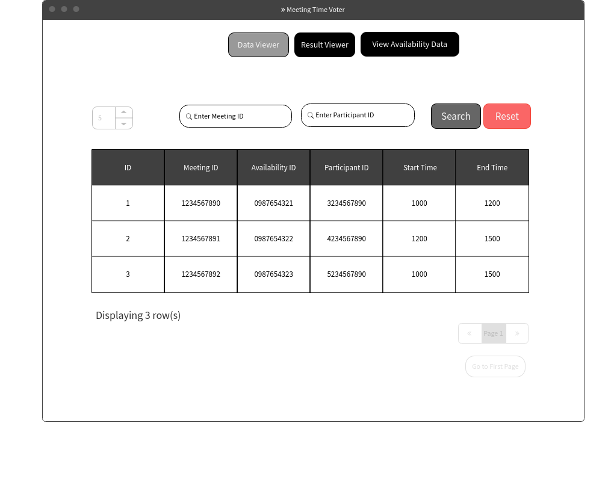
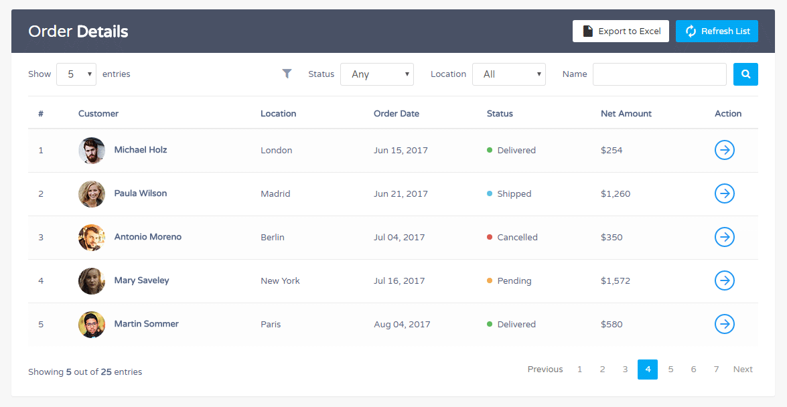
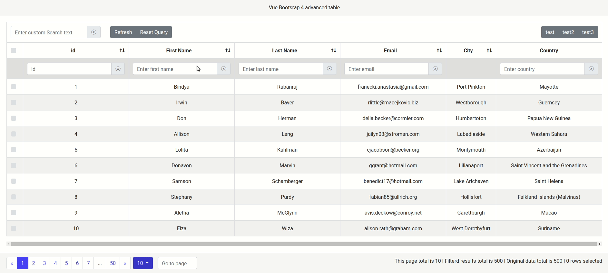

# Wireframe & Justification

This document should help you explain how your user interfaces are designed. You should have a wireframe to give a good overview and some screenshot with simple writeups to justify your designs.

## Wireframe

## Justifications

### Justification 1

(https://ourcodeworld.com/public-media/gallery/gallery-59fda3524cd7c.png)

#### Good Points

1. Clusters attributes together under 'order detail'
2. The table is scrollable, allowing for long pages of data to be easy accessible. (Much easier than scrolling through a long table)
3. Pagination is very useful and in-depth, it allows for retrieval for a vast amount of data (Rows & Page), it is also very easy to use.

#### Bad Points

1. There is only one search bar however the table has multiple attributes, so as a end user i would not be sure what the search bar would be filtering by and what input it requires.
2. At the top right there are many icons which are useful however, from the get go some of them are difficult to interpret and they are culstered closely together, making the overall page look over crowded. 
3. The 'Item Operate' column has a cross icon that may resemble the delete icon in the top left however, as a end user, i am unsure if this has the same action as the delete button or does this blue cross icon perform a temporary delete till the next refresh? (May be it is good to change the icon or the icon's color)

### Justification 2

(https://www.tutorialrepublic.com/snippets/designs/order-details-table-with-search-filter.png)

#### Good Points

1. Filtering is very informative and is based on the Attributes. If attributes' value are fixed it would be a drop down menu, if attributes' value are dynamic it allos for a search bar input.
2. The pagination is very neat and easy to use.
3. Allows data to be exported into a Excel.
4. Allows for the table to be refreshed.

#### Bad Points

1. There isn't a 'Jump to first page' button, so if i am on the last page, i would have to press previous button or click on a different page to return to the first page.
2. The action button is not clear to the end user, does it redirect me to another page and if so, why? Isn't all the data i need on the page i am viewing?

### Justification 3

(https://raw.githubusercontent.com/rubanraj54/vue-bootstrap4-table/develop/src/assets/img/demo.gif)

#### Good Points

1. Filtering is very detailed and informative.
2. Allows for each input to be cleared / reset.
3. Displaying of data filtered in the bottom right is very useful and informative.
4. The design is consistent through the page.

#### Bad Points

1. When there is only 1 row of data being displayed, i think the pagination should be disabled and the sorting icon in the table's header.
2. Reduce the size of some of the tables' columns so that we prevent scrolling along the x-axis. This can be quite troublesome especially for different devices with a small viewport.