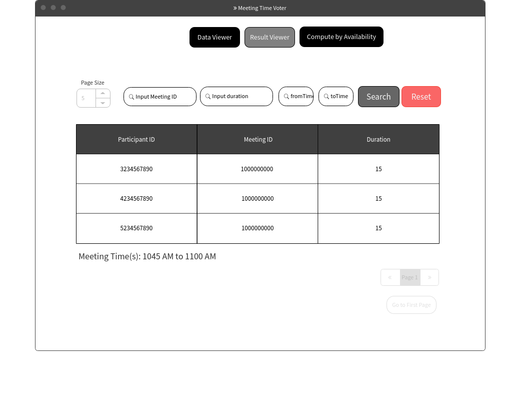
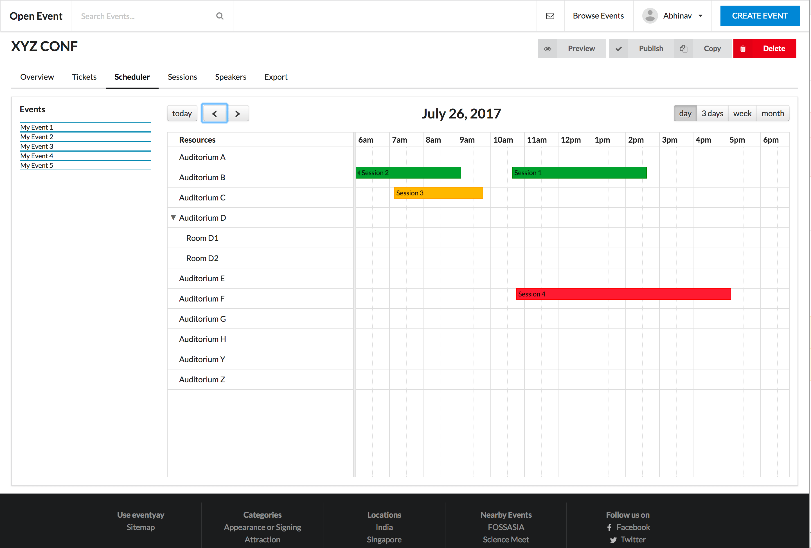
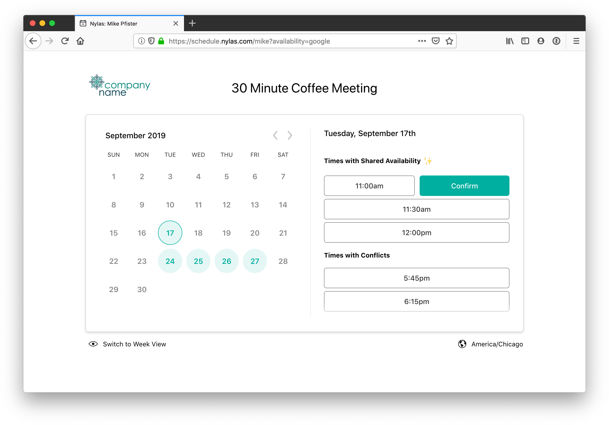
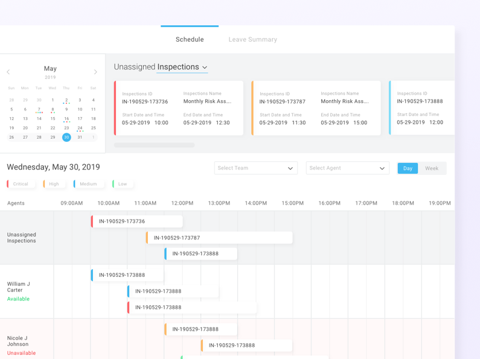

# Wireframe & Justification

This document should help you explain how your user interfaces are designed. You should have a wireframe to give a good overview and some screenshot with simple writeups to justify your designs.

## Wireframe

## Justifications

### Justification 1

(https://ourcodeworld.com/public-media/gallery/gallery-59fda3524cd7c.png)

#### Good Points

1. It displays the timing / schedule in a horizontal bar format which is easily readable.
2. Allows for viewing by day, 3 days, a week or a month.
3. Buttons above that allow for easy Read, Update & Delete operations.

#### Bad Points

1. The arrows up top to go previous and next are not clear, does it go to a next page or the next day? May be having a small text or a tool tip would be useful.
2. No consistency throughout the theme, some letters are capitalised some are not and the padding between buttons are not consistent across the page.
3. The color choices for the bar are not good, the black text on the dark green / dark red makes it difficult to read, change it to a lighter color.

### Justification 2

(https://www.tutorialrepublic.com/snippets/designs/order-details-table-with-search-filter.png)

#### Good Points

1. Theme is consistent and easy to use, making learnability easy.
2. The elements are easy to perceive and we know what happens upon click on it
3. It highlights the conflict in timing for the schedule / meeting.

#### Bad Points

1. The size of the calendar or rather the container that contains all the elements can be increased to make use of all the white space available in the page.
2. There isn't a cancel button if you do not wish to proceed with the confirmation.

### Justification 3

(https://raw.githubusercontent.com/rubanraj54/vue-bootstrap4-table/develop/src/assets/img/demo.gif)

#### Good Points

1. The theme is very attractive and more or less consistent throughout the page.
2. It allows for easy filtering based on fixed attributes and viewing of the schedule by day or week.
3. The buttons are easy to perceive, so are the drop downs such as at the 'Unassigned Operations', users do not have to guess what happens after clicking on a button, etc.

#### Bad Points

1. Components / Elements of the page are very close to each other and isn't segregated well, making the page look overcrowded.
2. Ther vetical link breakers in the time table are too light, against light gray or white, it is barely visible.
3. Make the calendar in the top left collapsible so that users do not have to scroll along the X-axis under the unassigned operations to see what each color code represents.