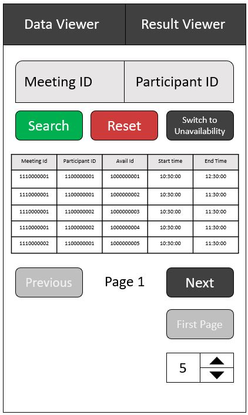
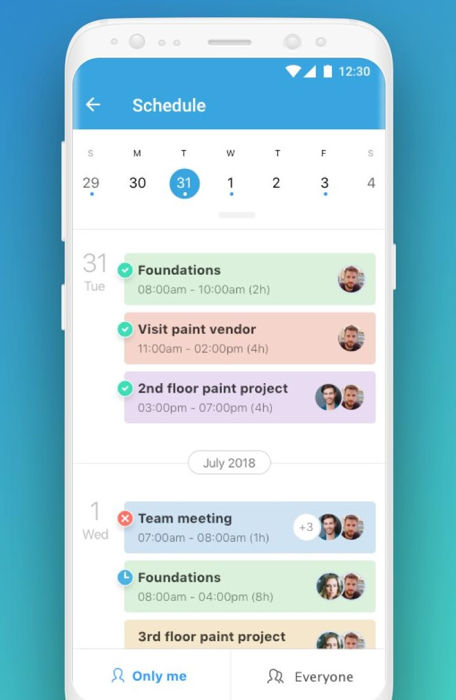
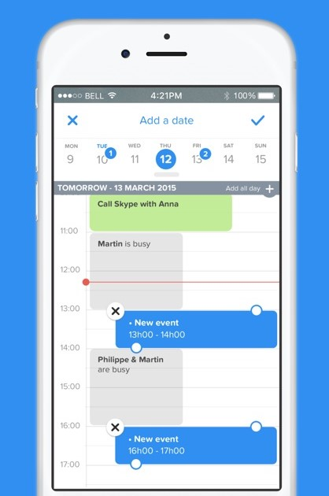
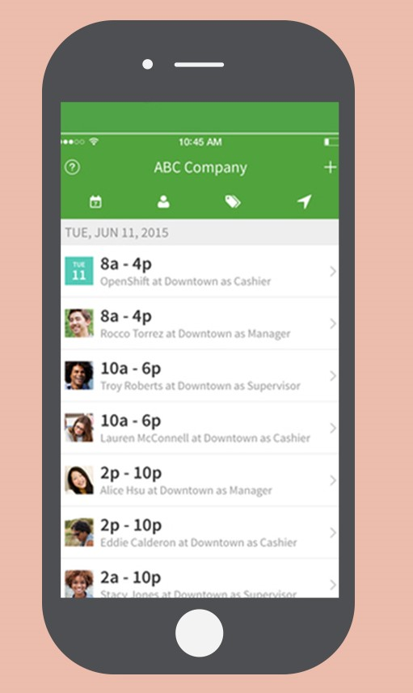

# Wireframe & Justification

This document should help you explain how your user interfaces are designed. You should have a wireframe to give a good overview and some screenshot with simple writeups to justify your designs.

## Wireframe

## Justifications

### Justification 1 (Connecteam App)

#### Good Points

1. Can sort out schedule base on individual or by everyone.
2. Shows what time & who is able to meet when
3. Uses date as its pagination instead of pages (Sorts by the day)
4. Uses color to show the different meetings

#### Bad Points

1. Does not allow user to filter base on specific requirements.

### Justification 2 (vyte.in)

#### Good Points

1. Can see which individuals are busy at which certain slots.
2. Shows what time & whose time slot is free
3. Uses date as its pagination instead of pages (Sorts by the day)

#### Bad Points

1. Does not allow user to filter base on specific requirements.
2. Might be quite difficult for one to see the overall time available for the whole day as it is timeline based.

### Justification 3 (WhenIWork)

#### Good Points

1. Can see which individuals the time slots that each individual is free clearly.
2. Automatically sorts by who is free base on start timing & end timing.
3. Uses date as its pagination instead of pages (Sorts by the day)

#### Bad Points

1. Does not allow user to filter base on specific requirements.

