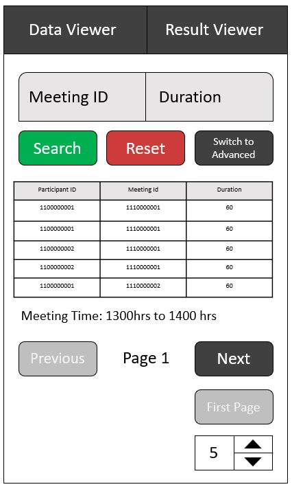
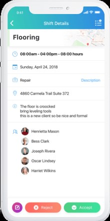
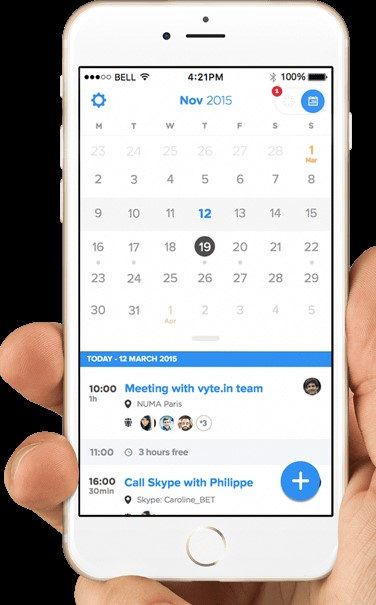
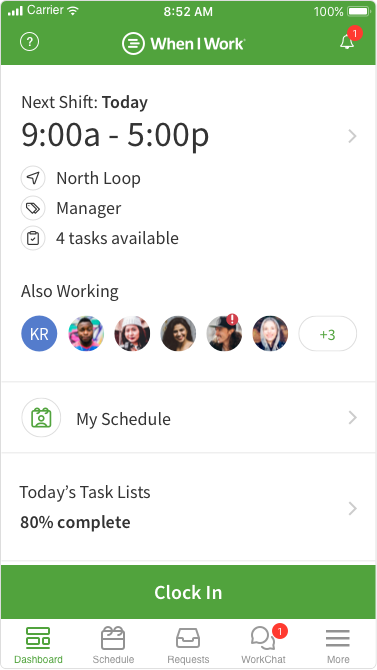

# Wireframe & Justification

This document should help you explain how your user interfaces are designed. You should have a wireframe to give a good overview and some screenshot with simple writeups to justify your designs.

## Wireframe

## Justifications

### Justification 1 (Connecteam App)

#### Good Points

1. Displays all the information needed. (Time, participants etc.)
2. Information is displayed clearly & not overcluttered.
3. Uses colour to allow user to see more clearly (Green for accept, red for reject)

#### Bad Points

1. Timing wise could be displayed better. Currently it shows as 08:00am - 04:00pm - 08:00 Hours; It can be better shown as 08:00am - 09:00pm (08:00 Hours) to prevent misconceptions & further clarity.
2. Does not allow user to filter base on specific requirements.

### Justification 2 (vyte.in)

#### Good Points

1. Meeting is sorted by date.
2. Information needed is all present (Time, participants etc. & duration of meeting)

#### Bad Points

1. Does not show ending time, which might be an issue if there are meetings stretched over longer durations; Waste user's time calculating when is the meeting ending time.
2. Does not allow user to filter base on specific requirements.

### Justification 3 (WhenIWork)

#### Good Points

1. Displays all the information needed. (Time, participants etc.)
2. Information is displayed clearly & not overcluttered.
3. Words are big & clear to users.

#### Bad Points

1. Does not allow user to filter base on specific requirements.
2. Timing can be clearer, write in fully as AM or PM instead of just A or M.
> See example in frontend wireframes
