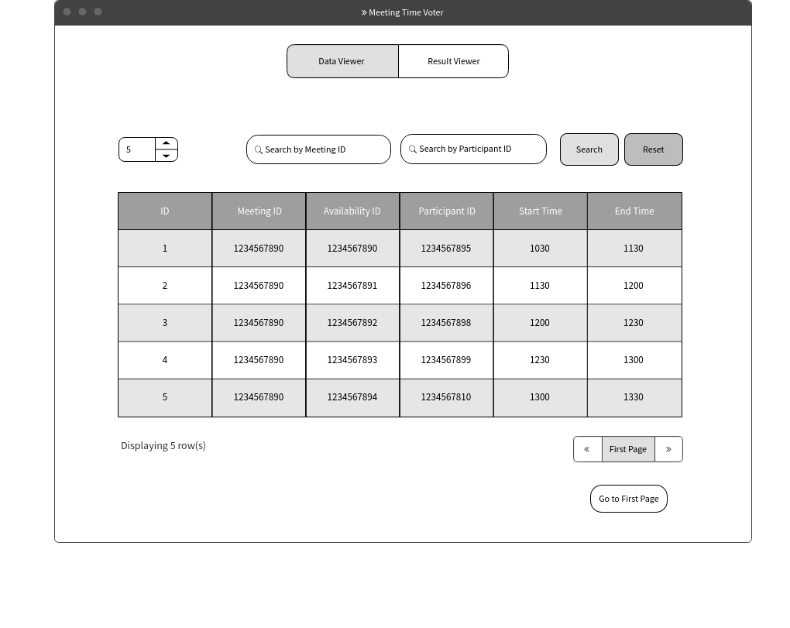
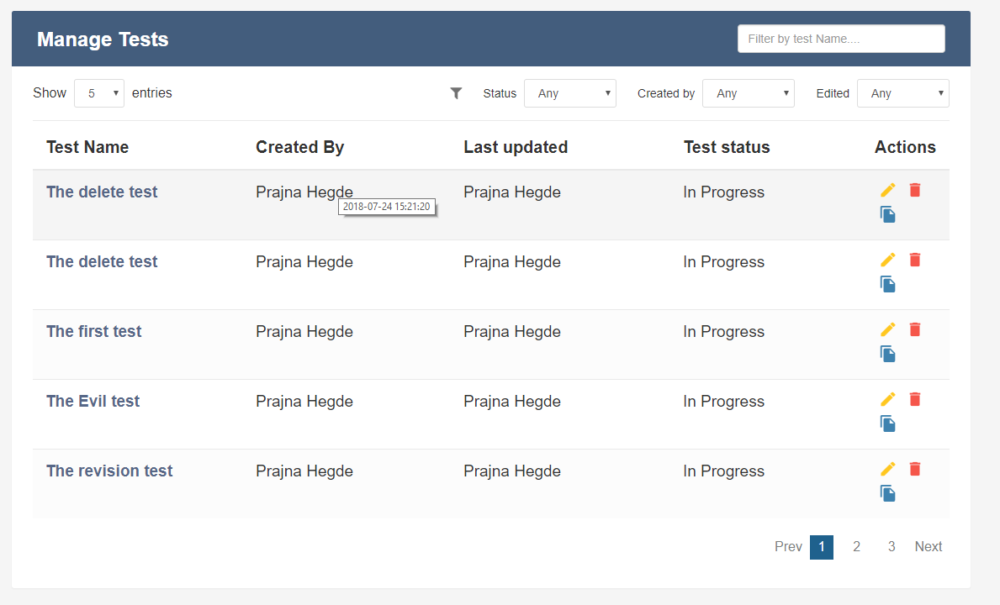
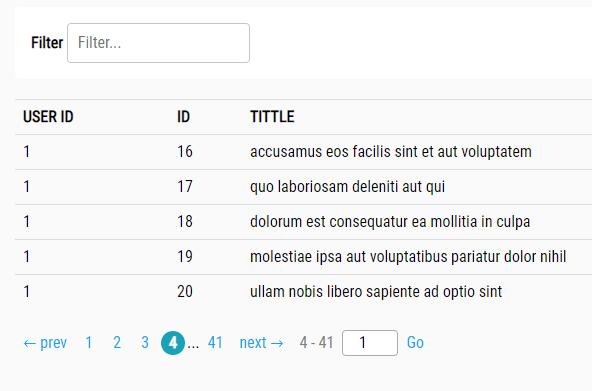
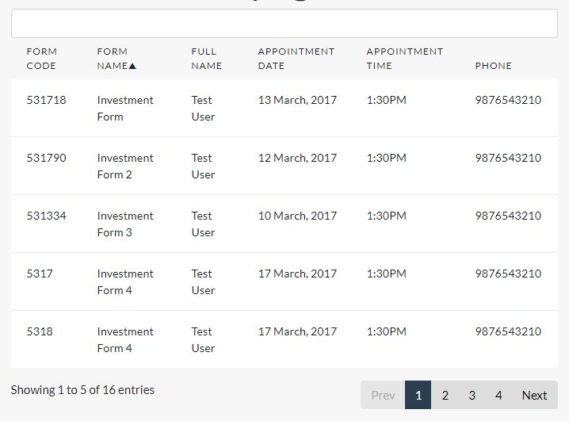

# Wireframe & Justification

This document should help you explain how your user interfaces are designed. You should have a wireframe to give a good overview and some screenshot with simple writeups to justify your designs.

## Wireframe

#### Good Points
1. Compared to the other wireframes, we wanted ours to have the main Components to be roughly in the same area. In this case on the right side. As seen, the pagination, seach bar and buttons are aligned to the right. This is because we noticed majority of the time, our cursor tends to be hovering on the right side of the page.
2. There is the ability to reset the search field(s) and the table upon searching for an entry in the database.
3. There is a even use of spacing for the components, preventing overcrowding and making usability a breeze as most of the components and straight forward.

#### Bad Points
1. The 'Go to first page' button looks odd and out of place however, we tried different locations and others were either not user friendly or created a problem of 'overcrowding'.
2. I believe the search bar can be orientated to be more neater such as by stacking them vertically and reducing their length.

## Justifications

### Justification 1

Design Interaction Principle #1: Consistency.
A large majority of the page has a consistent scheme however the little details such as the buttons under the 'Actions' column, are not in line. As seen in the wireframe, the edit and delete button are on the same line whereas the copy button is on the next. This brings inconsistency and difficulty to the user, as users are wired to be sensitive to change. By that, if we do not abide to the
Design Interaction Principles, users will encounter trouble trying to adapt and understand.

Design Interaction Principle #2: Perceivability
Perceivability is defined as the layout to invite the user to interact with components of the page. In this case, the website invites interaction by having the pagination, search bar andn drop down menus placed on the right side. However, the number of results to be displayed is on the left side, this would not invite interaction as users would have to navigation their mouse from the right side of the screen (Where all the actions are -E.g. Update, Delete, Pagination, Search) to the left side to just change the amount of data entries. This may render the data display as not welcoming, hence bad for inviting user interaction.

Design Interaction Principle #3: Learnability
The website has no major issues with learnability as it is quite straightforward and follows the standard icons (E.g. Edit represents a 'pen/pencil' while Delete represents a 'Rubbish Bin'). One thing that i did take note of is the 'Edited' drop down menu above. As none of the columns are titled 'Edited', this may cause confusion to the user as they may wonder what it does and how
the data would be filtered.

Design Interaction Principle #4: Predictability
The web page has good interaction design which sets the expecation and the outcome upon pressing the interaction elements.

Design Interaction Principle #5: Feedback
Feedback is good, upon clicking buttons it changes color and gives a user feedback assuring them that they have pressed on that button.Without feedback, it confuses users as to whether did they click on the button especially if there is no action or message after that. (E.g. I click on next page, but there isn't any more Data, i should display a Message and Highlight the Next Page Button or etc)

#### Good Points

Pros:

1.  Consistency -> The webpage has a consistent theme and functionality that makes it inviting to the user and gives it a professional look.
2.  Functionality -> The webpage offers many functionalities that are also easy to learn, such as the Search Filter, Edit, Delete and Copy button
3.  Feedback -> The webpage offers feedback such as highlighting the current page number and so on
4.  Learnability -> The webpage abides to the World Wide Web development standards making learnability a breeze

#### Bad Points

1. Needs more consistency such as placement of buttons and icons
2. Requires more text filtering rather than drop down menus to filter the data.
3. Slight confusion with the drop down filter titled 'Edited' as none of the columns are related to that, the user would not be able to understand the filtering for that.

### Justification 2

Design Interaction Principle #1: Consistency
The page does not have proper consistency. The spacing between the columns and the placement of buttons, etc are cluttered. Making the webpage not abide to consistency.

Design Interaction Principle #2: Perceivability
Apart from the Filter, the other buttons on the page does not invite interaction. The pagination is very messy with no proper spacing and line break for the 'Jump Page' button and the 'Go' button. At first look, the user would be confused and feel unsatisfactory, not inviting interaction.

Design Interaction Principle #3: Learnability
The webpage has no issues with learnability as it is very straight forward.

Design Interaction Principle #4: Predictability
The buttons on the webpage do have predictability issues. It does not let theuser know what the immediate outcome is. For example, upon typing into the filter search box, does it automatically search or must the user press the 'Enter' key on their keyboard. Secondly, the pages below, does jumping to a certain page reset the Filters and so on. These are issues that will cause users to not understand nor predict the result or outcome before/after interaction. 

Design Interaction Principle #5: Feedback
The website also does not provide proper feedback. It does not have buttons for the search filter or fineprint text to assist user in understanding the actions.

#### Good Points

1. Simple Design hence great learnability
2. Has unique functionality (Jump to pages)
3. Pagination is useful

#### Bad Points

1. Needs more filtering. It is very generic hence users do not know whether they are filtering by USERID, ID or TITLE.
2. Webpage needs to be consistent and user friendly
3. Pagination is very messy, should align the feature that allows users to jump to pages to the right side or if not on the next line

### Justification 3

Design Interaction Principle #1: Consistency
The website has a very consistent theme. It has equal padding / spacing between columns. Fonts are standardised. The number of entries being displayed and the pagination are on the same row and inline. Reflecting a very good use of the consistency principle.

Design Interaction Principle #2: Perceivability
The elements on the web page invites interaction except for the white bar above the column headers. It could be a search bar however there are no icons or text to indicate it to be a search bar. Users would not attempt to type it in, as they would assume it is part of the design whichcannot be interacted with. 

Design Interaction Principle #3: Learnability
The website has no issues with learnability. It abides to the World Wide Web development standards. Making learnability very easy for users as they are able to apply knowledge and skills from other sites into use here.  (E.g. Navigating the Pagination, etc)

Design Interaction Principle #4: Predictability
The outcome is also predictable. As the webpage is simple, we have the ability to change pages and that would already let the user know what the outcome would be. In this case, result would change as it moves to the second page.

Design Interaction Principle #5: Feedback
The website also has interaction feedback such as highlighting of buttons upon clicking it.

#### Good Points

1. Consistency -> The webpage has a neat layout, same font and the pagination & entries are inline
2. Predictability -> The webpage has elements that allows the users to expect the result upon a action / input.
3. Feedback -> The webpage offers user feedback so that the user understands the action they just pressed on was successful and not a 'misclick'
4. Number of data being displayed is very useful

#### Bad Points

1. Search bar may need to be more prominent, could be resolved by adding in a search icon or a text to identify it as a search bar.
