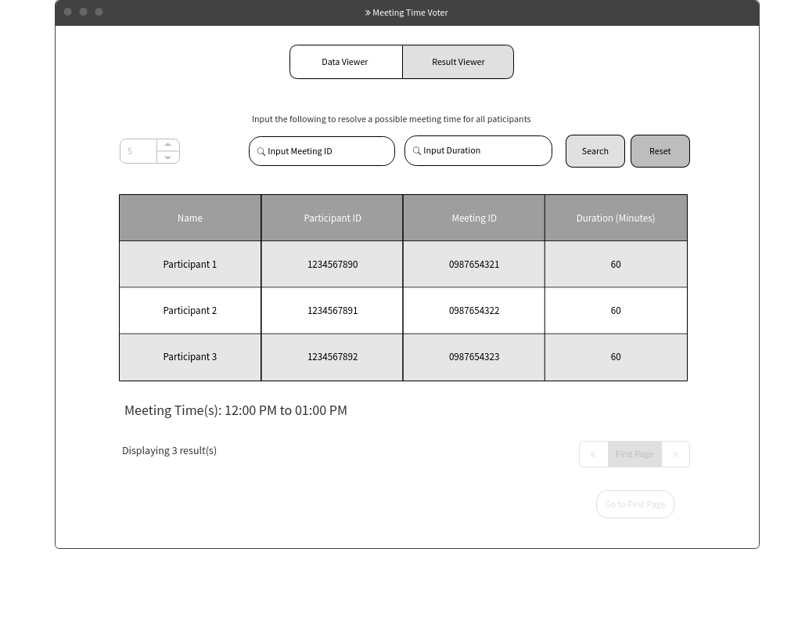
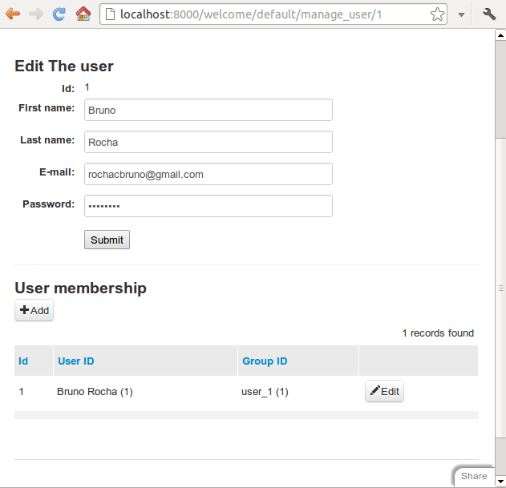
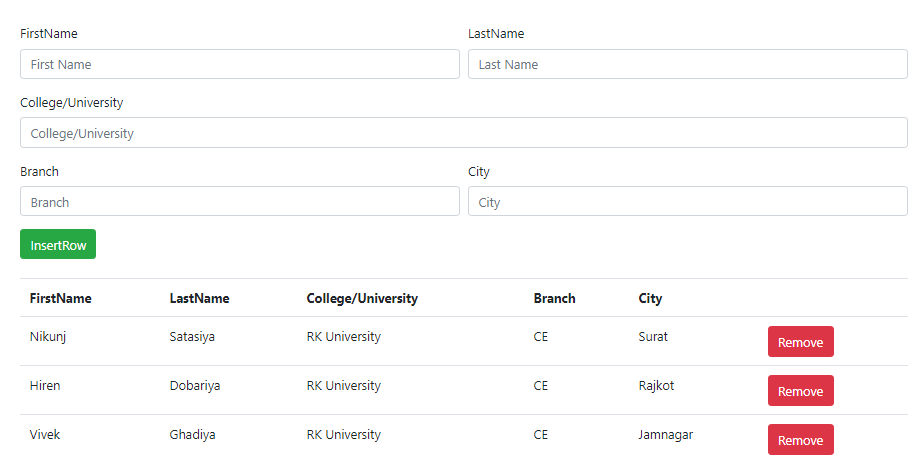
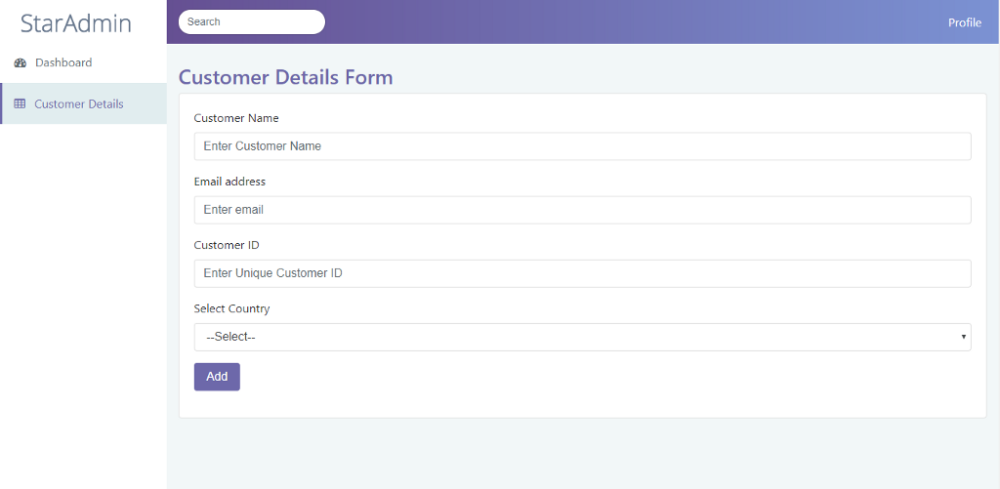
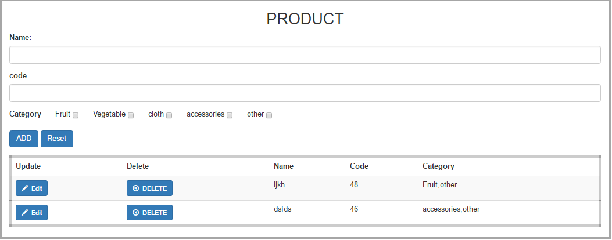

# Wireframe & Justification

This document should help you explain how your user interfaces are designed. You should have a wireframe to give a good overview and some screenshot with simple writeups to justify your designs.

## Wireframe

#### Good Points
1. Location of components allows for easy accessiblity.
2. Components are not complicated allowing for easy learnabiliy.
3. Consistency with the data viewer page, allowing for transfer of 'usability knowledge' from one page to the other.
4. Ability to reset the computed data and the input(s)

#### Bad Points
1. Display of the available meeting time is not pleasing. It could be translated into a table format or a much professional manner.
2. There is a text above the search field(s) to tell the user what the input does. I believe that means it might not be so obvious right off the bat, hence it would be better to incorporate it in a modal upon loading the result viewer page or place the help text in a help button. A tooltip may also do the job.

## Justifications

### Justification 1

#### Good Points

1. Approriate User Interface that is straight forward. User friendly.
2. Displays the relevant data to manage users
3. Information is not cluttered

#### Bad Points

1. Fields that are not editable should not be displayed such as 'ID'
2. We strongly feel that the user membership should be displayed on a different page. At the moment it acts as two pages in a page.
2. User Interface could be more attractive

### Justification 2

#### Good Points

1. User inteface is easy to use and is appropriate, also uses the full dimensions of a web page too prevent over crowding
2. Gives you the ability to delete users in addition to inserting them on the same page

#### Bad Points

1. The table that displays all the user's data with the 'Remove' button should be on a different page OR should have a search bar to filter out data as it is tedious to go through hundreds of records without that functionality.
2. Seeing as the placeholder data has 'CE' as a common value under the column titled 'Branch'. It might be easier to add in a drop down menu rather than get the user to type it in. A drop down menu for the 'City' input is also very helpful. This helps the user and also acts a form of error handling to prevent unwanted inputs.

### Justification 3

#### Good Points

1. Allows you to navigate to a Dashboard on the left side where you can manage other users. This segregates the functionality of each page and makes it much neater.
2. There is also a universal search bar above to search for relevant data as it is attached to the navbar.
3. Fields that are able to take advantage of drop down menus to prevent unwanted input, have been assigned drop down menus. Such as 'Select Country'.

#### Bad Points

1. Search bar can be more specific as typing into the search bar does not tell us what it is filtering out and how it is filtering it out.
2. It does not display the recently added records / results on the same page, this makes it difficult as the user would not know if he/she added in the data. May be adding in the recently added record / result in another table on the same page or simply displaying 1 row(s) returned would be beneficial.

### Justification 4

#### Good Points

1. Long input fields allowing for inputs up to varchar(255) or longtext without having the text cut off
2. There is a add and reset button that is conveniently placed. The reset button is unique as most of the other wireframes we have explored, lack such a feature.
3. Fixed value datas such as 'category' are selected via a checkbox, rather than user input. Acts as a form of error handling to prevent unwanted input.
4. Upon adding the user, it displays the data added immediately below with the ability to update and or delete it.

#### Bad Points

1. There could be more consistency. Some text are all in lower case while some are all in upper case. There should be consistency to make the page inviting to the user.
2. No filter for multiple data or results, could be a good feature if there are many rows to search from when a result is returned.